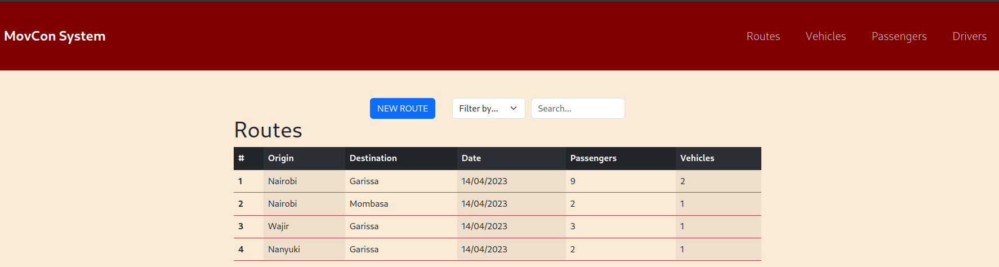

     
    <h1 style="font-weight: bold">MovCon App</h1>

  <a href="#description">Project Description</a> •
  <a href="#live-link">Live Link</a> •
  <a href="#setup">Project Setup</a> •
  <a href="#authors">Authors</a> •
  <a href="#license">License</a>

## Project Description
MovCon, short for **Movement Control**, is an app that is designed to track all the movement to and from various destinations, the vehicles, personnel and equipment involved in the particular movement.

It answers the who,where and when.

## Live Link
The project is hosted on [Render](render.com) and can be found here https://movcon-app.onrender.com

## Project Setup
To run the project locally,

> Clone this repo `git clone https://github.com/mashm3ll0w/phase-3-ip-frontend.git`
>
> Move into the directory `cd phase-3-ip-frontend`
>
> Install project dependencies `npm install`
>
>Spin up the server `npm start`
>
> Navigate on your browser to `http://localhost:3000`
>

Note:
1. This project depends on a backend that hosts the API and database.
Instructions for setting that up can be found [here](https://github.com/mashm3ll0w/phase-3-ip-backend)
2. Inorder to run this project locally, you will have to change the `fetch` urls in the project's component's to point to `http://localhost:9292` as that is where the aforementioned backend runs.

## Authors
[Charles Swaleh](https://github.com/mashm3ll0w)

## License

This software is licensed under the [MIT](https://github.com/mashm3ll0w/phase-3-ip-frontend/blob/master/LICENSE.md) License
